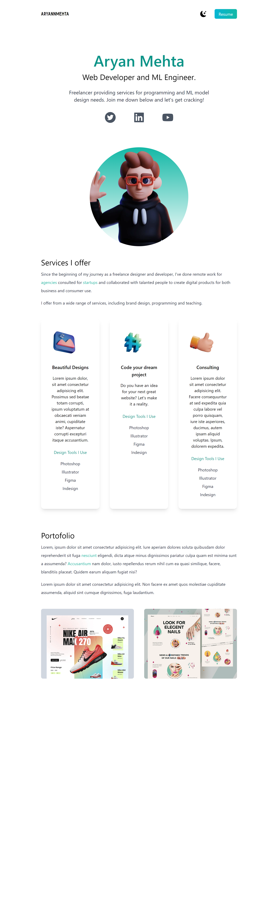
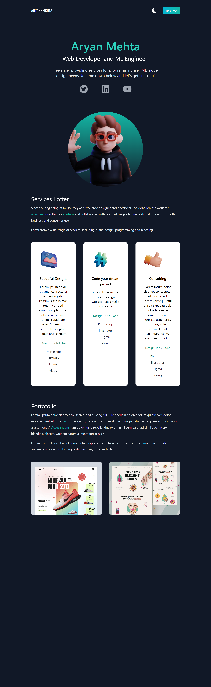

# React Portfolio Website

### (Uses: `React.js / Tailwind CSS / Next.js`)

1. First, clone this project or download the zip folder containing all the files used in this project.

2. Next, make sure you have `npm` installed and then run this command on your terminal: `npm install`.
This will install all the required dependencies in your project folder.

3. Now, run the development server:

```bash
npm run dev
# or
yarn dev
# or
pnpm dev
```

4. Open [http://localhost:3000](http://localhost:3000) with your browser to see the result.

5. You can start editing the page by modifying `pages/index.tsx`. The page auto-updates as you edit the file. Customize this website design to your liking!

---

## Output

This website is fully responsive and with tailwind's properties, it uses a mobile-first approach. It has a dark and a light mode to fit the user's preferences.

This is how it look!

 
